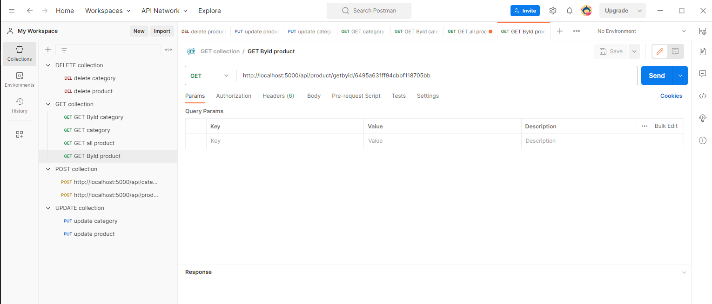

# NODEAPI_PROJECT
## Made By
        Zubaidov Shohruz 19200188
        Khalilov Kadir 19200186

# Packeges Installed:

    [+] npm i express --save
    [+] npm i mongoose --save
    [+] npm i http-status-code --save
    [+] npm i -g nodemon (Installed globaly)
    [+] npm i dotenv

# Models and Relationships

##  Products:
        _id
        name
        unitPrice
        categoryID

##  Categories
        _id
        name

##  Database Configuration
        Created new dir 'Config'

##  Creating Controller
##  Defining Routes
##  Postman Testing REST API
##  Repository Design Pattern
##  GET category or product
        [GET] http://localhost:5000/api/category/getall //getting all categories
        [GET] http://localhost:5000/api/products/getall //getting all products

        [GET] http://localhost:5000/api/category/getbyid/6495a631ff94cbbf118705bb     //getting category by ID
        [GET] http://localhost:5000/api/products/getbyid/6495a631ff94cbbf118705bb     //getting product by ID

## POST category or product
        [POST] http://localhost:5000/api/category/add  //post category
        
        JSON
        {
                "name": "category name"
        }

        [POST] http://localhost:5000/api/product/add  //post product

        JSON
        {
                "name": "namyanything",
                "unitPrice": 45,
                "categoryID": "the id of the category"
        }

## DELETE & UPDATE of category or product
        //JSON file should include the data to update
        [DELETE] http://localhost:5000/api/category/delete/*ID of a category*  //delete category
        [PUT] http://localhost:5000/api/category/update/*ID of a category*  //update category
        [DELETE] http://localhost:5000/api/product/delete/*ID of a product*  //delete category
        [PUT] http://localhost:5000/api/product/update/*ID of a product*  //update category

## OUR POSTMAN DASHBOARD
        